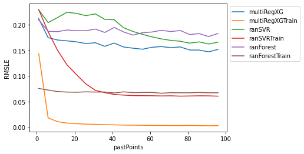
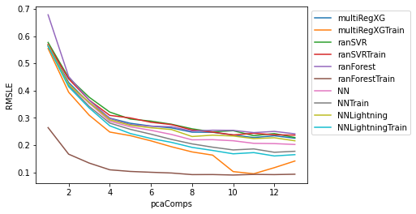
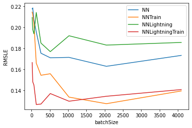
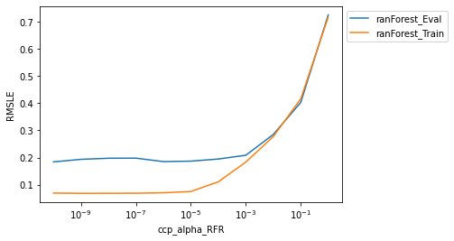
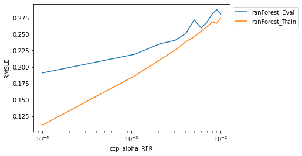
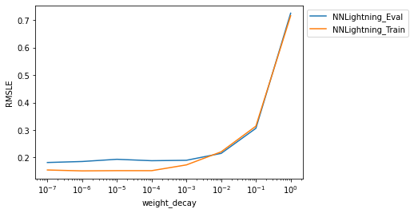

# Tabular Playground Series - Jul 2021

## Results of different hyperparameters and settings


```python
import pandas as pd
import pickle

def pickleLoad(filename):
    with open(rf'{filename}','rb') as f:
            return pickle.load(f)
```


```python
mainDir = r"E:\KaggleData\Tabular Playground Series - Jul 2021"
os.chdir(mainDir)
```

## Effect of adding past datapoints for different models


```python
loopVarName = "pastPoints"
resultsDf = pickleLoad(f'{loopVarName}_resultsDf.pkl')

resultsDf.plot(x=loopVarName,y=resultsDf.keys().to_list().remove(loopVarName)).legend(bbox_to_anchor=(1,1))
plt.ylabel("RMSLE")
```


    Text(0, 0.5, 'RMSLE')


    

    


## Effect of using PCA to reduce dimensionality


```python

loopVarName = "pcaComps"

resultsDf = pickleLoad(f'{loopVarName}_resultsDf.pkl')

resultsDf.plot(x=loopVarName,y=resultsDf.keys().to_list().remove(loopVarName)).legend(bbox_to_anchor=(1,1))
plt.ylabel("RMSLE")
```


    Text(0, 0.5, 'RMSLE')


    

    


## Effect of batch size on training NNs


```python

loopVarName = "batchSize"
extraText = "_12_PastPoints_No_PCA"

resultsDf = pickleLoad(f'{loopVarName}{extraText}_resultsDf.pkl')

resultsDf.plot(x=loopVarName,y=resultsDf.keys().to_list().remove(loopVarName)).legend(bbox_to_anchor=(1,1))
plt.ylabel("RMSLE")
```


    Text(0, 0.5, 'RMSLE')


    

    


## Effect of ccp alpha penalization parameter for random forest


```python
loopVarName = "ccp_alpha_RFR"
extraText = "_12_PastPoints_No_PCA"

resultsDf = pickleLoad(f'{loopVarName}{extraText}_resultsDf.pkl')

resultsDf.plot(x=loopVarName,y=resultsDf.keys().to_list().remove(loopVarName)).legend(bbox_to_anchor=(1,1))
plt.ylabel("RMSLE")
plt.xscale('log')
```


    

    


## Effect of ccp alpha penalization parameter for random forest


```python
loopVarName = "ccp_alpha_RFR"
extraText = "_SmallerRange_12_PastPoints_No_PCA"

resultsDf = pickleLoad(f'{loopVarName}{extraText}_resultsDf.pkl')

resultsDf.plot(x=loopVarName,y=resultsDf.keys().to_list().remove(loopVarName)).legend(bbox_to_anchor=(1,1))
plt.ylabel("RMSLE")
plt.xscale('log')
```


    

    


## Effect of weight decay penalization parameter for NN_Lightning


```python
loopVarName = "weight_decay"
extraText = "Lightning_12_PastPoints_No_PCA"

resultsDf = pickleLoad(f'{loopVarName}{extraText}_resultsDf.pkl')

resultsDf.plot(x=loopVarName,y=resultsDf.keys().to_list().remove(loopVarName)).legend(bbox_to_anchor=(1,1))
plt.ylabel("RMSLE")
plt.xscale('log')
```


    

    

